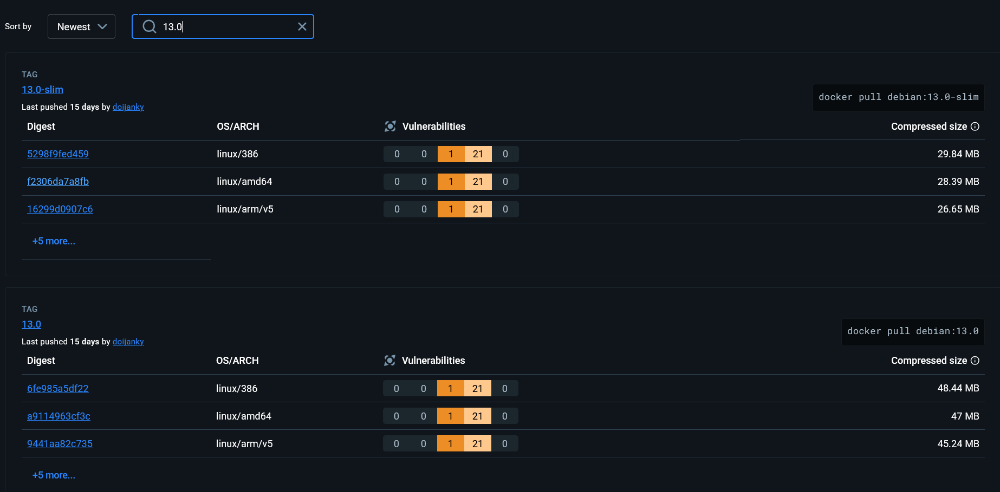
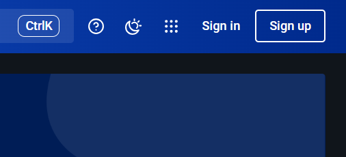
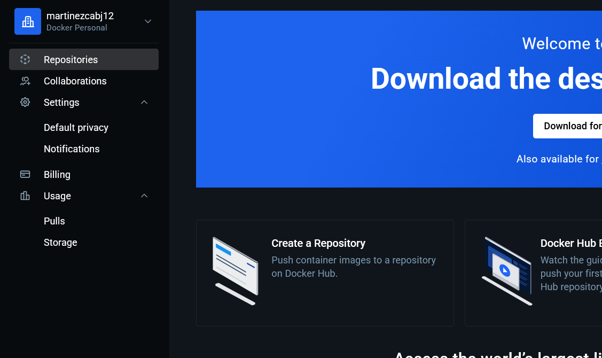
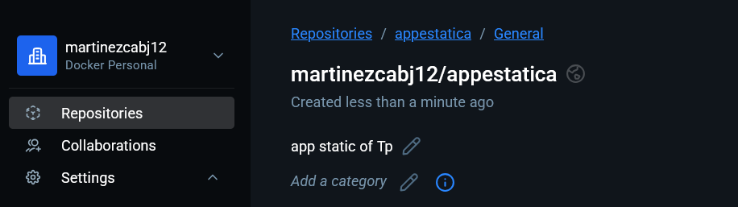
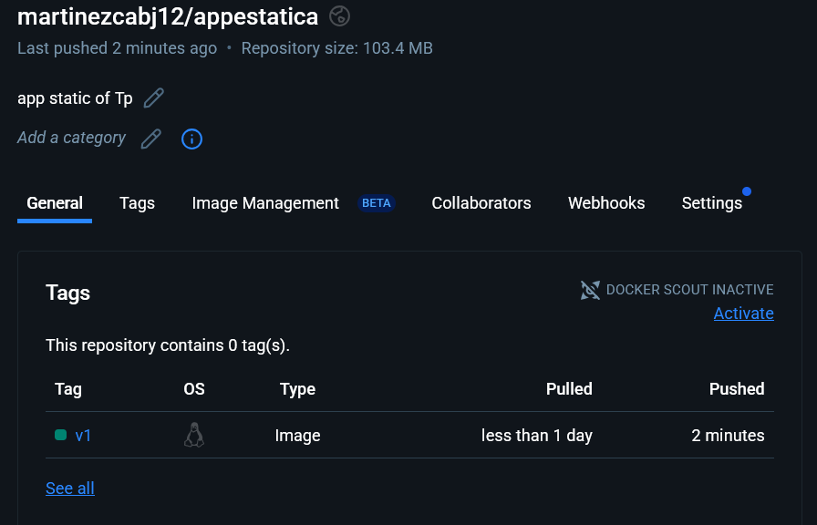
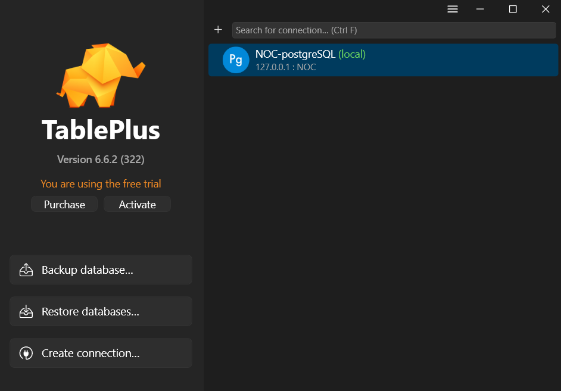
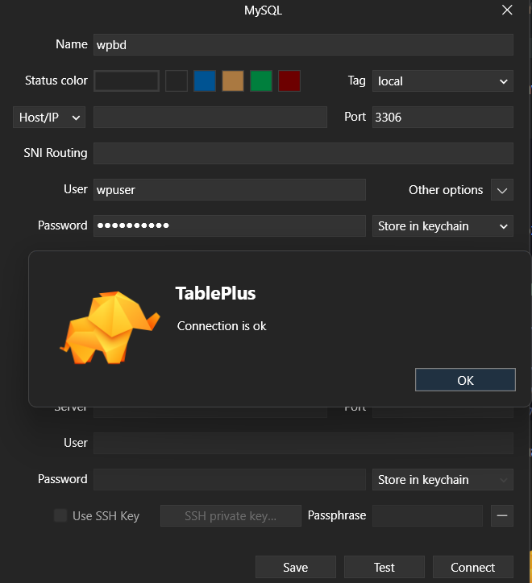
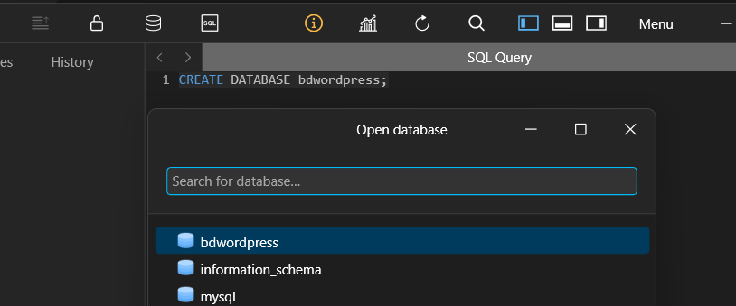

# Herramientas Informaticas Avanzadas - APU

- Alumno: Dario Abel Martinez
- LU: APU004455

## Practica ambiente de Desarrollo con Docker

### Punto 1 - Gestion de Imágenes - Linea de comando

1. Descargar una imagen para el s.o debian v13.0 y Cree un container basado en esta imagen.

- Buscamos en docker hub el repositorio oficial de `Debian` y en la pestaña de tags buscamos la version `13.0`



```bash
# Con este comando descargamos la imagen
> docker pull debian:13.0

13.0: Pulling from library/debian
80b7316254b3: Pull complete
Digest: sha256:6d87375016340817ac2391e670971725a9981cfc24e221c47734681ed0f6c0f5
Status: Downloaded newer image for debian:13.0
docker.io/library/debian:13.0

# Para crear un contenedor basado en esta imagen
> docker run -it --name mi_debian debian:13.0 bash
root@55324fa460e2:/#
```

2. Modifique el container de debían de manera tal de instalar sobre el un Servidor de aplicaciones Web de su preferencia (Apache) que sirva un sitio estático (solo html,css,js).

- Usaremos `Apache2` como servidor web y crearemos un archivo `index.html` para servirlo.

```bash
# Ingresaremos al contenedor
# Actualizamos e instalamos apache2
? docker start -ai mi_debian
root@55324fa460e2:/# apt update
Get:1 http://deb.debian.org/debian trixie InRelease [138 kB]
Get:2 http://deb.debian.org/debian trixie-updates InRelease [47.1 kB]
Get:3 http://deb.debian.org/debian-security trixie-security InRelease [43.4 kB]
Get:4 http://deb.debian.org/debian trixie/main amd64 Packages [9668 kB]
Get:5 http://deb.debian.org/debian trixie-updates/main amd64 Packages [2432 B]
Get:6 http://deb.debian.org/debian-security trixie-security/main amd64 Packages [30.1 kB]
Fetched 9928 kB in 2s (4967 kB/s)
All packages are up to date.
root@55324fa460e2:/# apt install -y apache2
Installing:
  apache2

Installing dependencies:
  adduser          krb5-locales             libbrotli1   libgdbm-compat4t64  libidn2-0     libkrb5support0  libnghttp2-14  libpsl5t64           libssh2-1t64           media-types        procps
  apache2-bin      libapr1t64               libcom-err2  libgdbm6t64         libjansson4   libldap-common   libnghttp3-9   librtmp1             libtasn1-6             netbase            psmisc
  apache2-data     libaprutil1-dbd-sqlite3  libcurl4t64  libgnutls30t64      libk5crypto3  libldap2         libp11-kit0    libsasl2-2           libunistring5          openssl            publicsuffix
  apache2-utils    libaprutil1-ldap         libexpat1    libgpm2             libkeyutils1  liblua5.4-0      libperl5.40    libsasl2-modules     libxml2                perl               ssl-cert
  ca-certificates  libaprutil1t64           libffi8      libgssapi-krb5-2    libkrb5-3     libncursesw6     libproc2-0     libsasl2-modules-db  linux-sysctl-defaults  perl-modules-5.40


Summary:
  Upgrading: 0, Installing: 55, Removing: 0, Not Upgrading: 0
  Download size: 19.4 MB
  Space needed: 86.1 MB / 1022 GB available

Get:1 http://deb.debian.org/debian trixie/main amd64 perl-modules-5.40 all 5.40.1-6 [3019 kB]
Get:2 http://deb.debian.org/debian trixie/main amd64 libgdbm6t64 amd64 1.24-2 [75.2 kB]

done
root@55324fa460e2:/# cd var/www/html/
root@55324fa460e2:/var/www/html# ls
index.html

root@55324fa460e2:/var/www/html# vim index.html
root@55324fa460e2:/var/www/html# service apache2 start
Starting Apache httpd web server: apache2AH00558: apache2: Could not reliably determine the servers fully qualified domain name, using 172.17.0.2. Set the 'ServerName' directive globally to suppress this message
...
root@55324fa460e2:/var/www/html# exit
exit

> docker commit mi_debian_web mi_debian_apache:1.0

Error response from daemon: No such container: mi_debian_web

> docker commit mi_debian mi_debian:1.0
sha256:673c0c1c676540d1de27f70bf6e489d843ba7990433509218f1cd5b94e7d86d1

# Listamos las imagenes para ver que se creo correctamente
> docker images
REPOSITORY   TAG       IMAGE ID       CREATED          SIZE
mi_debian    1.0       673c0c1c6765   21 seconds ago   413MB # <-- Imagen creada
app-react    latest    f174c9776479   28 hours ago     382MB
debian       13.0      6d8737501634   2 weeks ago      183MB
postgres     latest    4d89c9048352   2 months ago     621MB
mongo        6.0.6     e3fa459b4f4b   2 years ago      907MB

# Levantamos el contenedor en modo demonio y mapeando el puerto 80 del contenedor al puerto 50 de la maquina host
# y ejecutamos apache en primer plano
> docker run -dit --name ctapache01 -p 50:80 mi_debian:1.0 apache2ctl -D FOREGROUND
2f238240ba8300d7e1f3feda9912eed432013614fe719107631f0adfc58756cc

# Para iniciar el contenedor
> docker start ctapache01 # Podemos iniciar con el nombre del contenedor
> docker start 2f2  # Podemos iniciar con los primeros 3 digitos del ID del contenedor

```

4. Suba la imagen creada anteriormente a Docker hub, comandos a utilizar "Docker login" y "Docker
   push". Investigue el proceso. Recuerde que el nombre de la imagen deber�a seguir el siguiente formato
   username/appestatica:v1.

- Primero debemos loguearnos en docker hub

[Pagina web - Docker Hub](https://hub.docker.com/)



- Luego debemos crear el repositorio en docker hub



- Agregamos el nombre del repositorio y la descripcion



- Debemos renombrar la imagen creada con el formato `username/appestatica:v1`

```bash
> docker images
REPOSITORY   TAG       IMAGE ID       CREATED        SIZE
mi_debian    1.0       7905dfd1e609   4 days ago     413MB # <-- Imagen que debemos hacer push al docker hub
app-react    latest    f174c9776479   6 days ago     382MB
debian       13.0      6d8737501634   3 weeks ago    183MB
postgres     latest    4d89c9048352   2 months ago   621MB
mongo        6.0.6     e3fa459b4f4b   2 years ago    907MB

> docker image tag mi_debian:1.0 martinezcabj12/appestatica:v1

> docker images
REPOSITORY                   TAG       IMAGE ID       CREATED        SIZE
mi_debian                    1.0       7905dfd1e609   4 days ago     413MB
martinezcabj12/appestatica   v1        7905dfd1e609   4 days ago     413MB
app-react                    latest    f174c9776479   6 days ago     382MB
debian                       13.0      6d8737501634   3 weeks ago    183MB
postgres                     latest    4d89c9048352   2 months ago   621MB
mongo                        6.0.6     e3fa459b4f4b   2 years ago    907MB
```

- Debemos iniciar sesion en docker hub desde la terminal

```bash
> docker login
Authenticating with existing credentials... [Username: martinezcabj12]

i Info -> To login with a different account, run 'docker logout' followed by 'docker login'


Login Succeeded
```

- Ahora debemos hacer push de la imagen creada a docker hub con the tag correspondiente

```bash
> docker push martinezcabj12/appestatica:v1
The push refers to repository [docker.io/martinezcabj12/appestatica]
98229db7801f: Pushed
80b7316254b3: Mounted from library/debian
v1: digest: sha256:7905dfd1e6098e9eac4f136d44005286806ff4696e20c1acbfceb83d1e0d9400 size: 750
# Tenemos la imagen subida a docker hub
```



- Ahora podemos ejecutar el contenedor desde cualquier maquina que tenga docker instalado

### Punto 2 - Gestion de Redes - Linea de comando

1. Cree en una red redPractica un contenedor de Base de Datos wpbd con mysql. Haga que el mismo
   exponga su puerto 3306 hacia afuera

```bash
# Creamos el contenedor de mysql en la red redPractica
> docker network create redPractica
# De esta manera creamos la red
d1e2f3b4c5a6b7c8d9e0f1a2b3c4d5e6f7g8h9i0j1k2l3m4n5o6p7q8r9s0t1u2v3w4x5y6z7

# Ahora creamos el contenedor de mysql en la red creada
> docker run -dit --name wpbd --network redPractica -e MYSQL_ROOT_PASSWORD=root -e MYSQL_USER=wpuser -e MYSQL_PASSWORD=wppassword -p 3306:3306 mysql:9.4.0

# Los env son para setear las variables de entorno necesarias para la creacion de la base de datos
# MYSQL_ROOT_PASSWORD es obligatorio
# MYSQL_DATABASE es para crear la base de datos al iniciar el contenedor
# MYSQL_USER y MYSQL_PASSWORD son para crear un usuario con permisos sobre la base de datos creada
# La version 9.4.0 es la ultima version estable al momento de hacer la practica
```

2. Utilice un cliente (Windows o web) de Base de Datos (dbeaver, dbschema, phpmyadmin, etc) y
   conectese al contenedor creado anteriormente, luego de hacerlo cree una base de datos bdwordpress.

- Usaremos `TablePlus` como cliente de base de datos



- Configuramos la conexion con los datos del contenedor y haremos un test de conexion



- crearemos la base de datos `bdwordpress`



